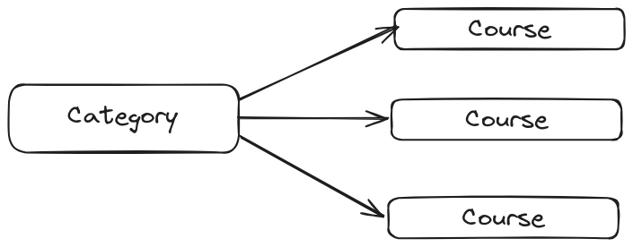

# Categories

This is an application that a wrote to practice graphQL. There are 2 entities to interact, `Categories` and `Courses`.

Categories has many Courses, and Courses has one Category.



## Queries and Mutations

You can use these queries and mutations below.

```graphql
  query listCategories {
    listCategories{
      id
      name
      description
      insertedAt
      updatedAt
    }
  }

  query listCourses {
  listCourses{
    id
    name
    description
  }
}

mutation CreateCategory($name: String!, $description: String) {
	createCategory(name: $name, description: $description) {
    id
  }
}

mutation CreateCourse($name: String!, $description: String, $categoryId: Integer!) {
	createCourse(name: $name, description: $description, categoryId: $categoryId) {
    id
  }

```

## How to run?

The application and database are in containers, so you'll need to have docker installed.
Run `docker-compose up -d` and the application will run in `http://localhost:4000/api/grapihl`
